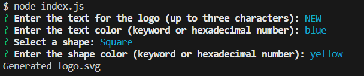
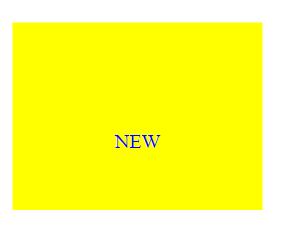

# Logo_Creator

## Repo Link

https://github.com/matthewlazarowitz/Logo_Creator

## Screenshot

## Description

For this challenge, we were tasked with creating a Node.js command-line application that generates simple logos for various projects.  The application allows users to input text, select colors, and choose from different shapes such as circles, triangles, and squares. It then generates an SVG file that represents the user's logo design. The generated logo is a combination of the chosen shape, the specified colors, and the provided text.  To accomplish this, we utilized the Inquirer package to collect user input and the Jest framework for running unit tests. The core functionality of the application lies in the shape classes (Circle, Triangle, and Square) defined in the "shapes.js" file. Each shape class has a render method that returns an SVG string representing the shape with the specified color. The main "index.js" file handles user input, generates the logo by combining the shape and text elements, and saves it as an SVG file.  Throughout the development process, we applied our knowledge of JavaScript, Node.js, and SVG rendering to create a reliable and efficient logo generation tool. By completing this project, we gained experience in working with command-line interfaces, user input validation, and file operations. Additionally, the use of Jest allowed us to ensure the functionality and correctness of the shape classes through comprehensive unit tests.

## Installation

N/A

## Usage

This terminal application was a fun test of our knowledge on the use of tools we have learned in class.  Unfortunately I do not think this app creates a logo that would be up to standards these days since it is very basic.  I can only imagine the intense coding that goes into making these incredibly in depth shaded, animated, etc. logos, but it is very useful to see the building blocks to getting to that kind of level.  If someone has the need for a basic logo quickly, this app is perfect for that.  Possibly as my skills grow, maybe I can find ways to allow users to customize their logo even further!

## Credits

(JD Tadlock)  (RUT-VIRT-FSF-FT-05-2023-U-LOLC)

## License

MIT License

Copyright (c) 2023 matthewlazarowitz

Permission is hereby granted, free of charge, to any person obtaining a copy
of this software and associated documentation files (the "Software"), to deal
in the Software without restriction, including without limitation the rights
to use, copy, modify, merge, publish, distribute, sublicense, and/or sell
copies of the Software, and to permit persons to whom the Software is
furnished to do so, subject to the following conditions:

The above copyright notice and this permission notice shall be included in all
copies or substantial portions of the Software.

THE SOFTWARE IS PROVIDED "AS IS", WITHOUT WARRANTY OF ANY KIND, EXPRESS OR
IMPLIED, INCLUDING BUT NOT LIMITED TO THE WARRANTIES OF MERCHANTABILITY,
FITNESS FOR A PARTICULAR PURPOSE AND NONINFRINGEMENT. IN NO EVENT SHALL THE
AUTHORS OR COPYRIGHT HOLDERS BE LIABLE FOR ANY CLAIM, DAMAGES OR OTHER
LIABILITY, WHETHER IN AN ACTION OF CONTRACT, TORT OR OTHERWISE, ARISING FROM,
OUT OF OR IN CONNECTION WITH THE SOFTWARE OR THE USE OR OTHER DEALINGS IN THE
SOFTWARE.

